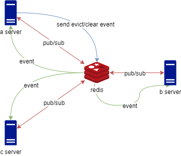
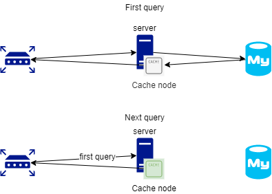
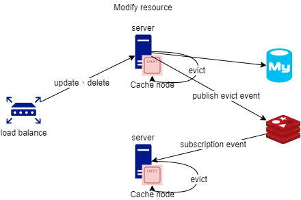

# Polar Bear Cache

## Goal

* 多服務架構下，依舊使用本地緩存
* 減少第三方緩存服務的壓力
* 減少網路 __I/O__ 和建構物件的CPU消耗，提高效能
* 相容 __Spring Cacheable__

## 設計

由於緩存通常應用在不頻繁異動的資料上，所以不應該每次都向第三方緩存服務取得資料，而是透過 __MQ Service__ 廣播和訂閱訊息功能，發布註銷的事件，將對應的資料清除，大幅提高系統效能，降低龐大架構的維護成本







* 由於緩存通常應用在不頻繁異動的資料上
* 透過 __Message Queue Server__ 發布和訂閱訊息功能，通知所有服務註銷本地的緩存

## Usage

### Single Service

__SpringBootApplication__
```java
@EnablePolarBearCache
@SpringBootApplication
public class Application {
    public static void main(String[] args) {
        SpringApplication.run(Application.class, args);
    }
}
```

__CacheConfig__
```java
public class CacheConfig {
  @Bean
  @Primary
  public PolarBearCacheManager polarBearCacheManager() {
      return new BasicCacheManager();
  }
}
```

### Multi Service

The architecture of multiple services needs to send evict events to other services through EventService.

__SpringBootApplication__
```java
@EnablePolarBearCache
@SpringBootApplication
public class Application {
    public static void main(String[] args) {
        SpringApplication.run(Application.class, args);
    }
}
```

__CacheEventServiceImpl__
    
Redis example.

```java
public class CacheEventServiceImpl extends PolarBearCacheEventService implements InitializingBean {
    @Autowired
    private StringRedisTemplate stringRedisTemplate;

    @Autowired
    private RedisMessageListenerContainer redisMessageListenerContainer;

    @Autowired
    private DefaultClientResources defaultClientResources;

    private final String topic = "cache";
    
    @Override
    public void afterPropertiesSet() throws Exception {
        defaultClientResources.eventBus().get().subscribe((event) -> {
            if (event instanceof ConnectedEvent) {
                publishConnectedEvent();
            }
        });
    }

    @Override
    public void send(String body) {
        stringRedisTemplate.convertAndSend(topic, body);
    }

    @Override
    public void addListener(Consumer<String> listener) {
        redisMessageListenerContainer.addMessageListener((message, pattern) -> {
            log.info("pattern:{},message:{}", new String(pattern), message);
            listener.accept(new String(message.getBody()));
        }, new PatternTopic(topic));
    }
}
```

__CacheConfig__

```java
public class CacheConfig {
  @Bean
  public PolarBearCacheEventService polarBearCacheEventService() {
      return new CacheEventServiceImpl();
  }

  @Bean
  @Primary
  public PolarBearCacheManager polarBearCacheManager() {
      return new BasicCacheManager();
  }
}
```

### 使用方式

Reference __Spring Cacheable__

* __@Cacheable__

  * __一般__

      ```java
      public class UserService {
        @Cacheable(
            cacheNames = "User"
            , key = "#id"
            , condition = "#id != null"
            , unless = "#result==null"
        )
        public User find(Integer id) {
            // TODO
        }
      }
      ```

  * __時效性__

    ```java
      import pers.clare.polarbearcache.annotation.CacheAlive;
  
      public class UserService {
        @CacheAlive("PT30S")
        @Cacheable(
            cacheNames = "User"
            , key = "#id"
            , condition = "#id != null"
            , unless = "#result==null"
        )
        public User find(Integer id) {
            // TODO
        }
    }
    ```

* __@CacheEvict__

  如果有配置 __Event Service__ 時，會將 __Evict Event__ 廣播給其他使用相同配置的服務

  __一般__

    ```java
    public class UserService {
      @CacheEvict(
          cacheNames = "User"
          , key = "#user.id"
          , condition = "#user.id != null"
      )
      public void update(User user) {
          //TODO
      }
    }
    ```

* __BeeCacheDependencies__

  It also clears itself when dependency cache triggers the __evict__ event.

  ```java
  public class TestService implements InitializingBean {
  
    @Autowired
    private PolarBearCacheDependencies cacheDependencies;
  
    @Override
    public void afterPropertiesSet() {
      // Test cache  depends on user cache
      cacheDependencies.depend("Test", (key) -> {
          // Convert key
          return key;
      }, "User");
    }
  }
  
  ```

* 註冊 __Evict__ 的事件處理

  當本地有該緩存資源時，則會觸發 __handler__ 取得最新資料，直接更新緩存，避免同時請求造成多次查詢或者鎖的等待。

  ```java
  public class UserService implements InitializingBean {
    @Autowired
    private PolarBearCacheManager cacheManager;
  
    @Override
    public void afterPropertiesSet() {
      cacheManager.<User>onEvict(UserCacheKey, (key, data) -> find(data.getId()));
    }
  }
  ```
  
