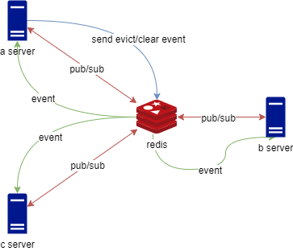

# polar-bear-cache

## 目標

* 多服務架構下，依舊使用本地緩存
* 減少第三方緩存服務的壓力
* 避免網路 __I/O__ 和資料結構轉換的消耗，提高效能
* 相容 __Spring Cacheable__

## 設計

由於緩存通常應用在不頻繁異動的資料上，所以不應該每次都向第三方緩存服務取得資料，而是透過 __MQ Service__ 廣播和訂閱訊息功能，發布註銷的事件，將對應的資料清除，大幅提高系統效能，降低龐大架構的維護成本




* 由於緩存通常應用在不頻繁異動的資料上
* 透過 __Message Queue Server__ 發布和訂閱訊息功能，通知所有服務註銷本地的緩存

## 使用

### Message Queue Service

如果是單服務，則不用實作

```java

@Log4j2
@Service
public class BeeCacheMQServiceImpl extends AbstractBeeCacheMQService implements InitializingBean {
    @Autowired
    private StringRedisTemplate stringRedisTemplate;

    @Autowired
    private MyRedisMessageListenerContainer myRedisMessageListenerContainer;

    @Autowired
    private DefaultClientResources defaultClientResources;

    @Override
    public void afterPropertiesSet() throws Exception {
        defaultClientResources.eventBus().get().subscribe((event) -> {
            if (event instanceof ConnectedEvent) {
                publishConnectedEvent();
            }
        });
    }

    @Override
    public void send(String topic, String body) {
        stringRedisTemplate.convertAndSend(topic, body);
    }

    @Override
    public void addListener(String topic, Consumer<String> listener) {
        myRedisMessageListenerContainer.addMessageListener((message, pattern) -> {
            log.info("pattern:{},message:{}", new String(pattern), message);
            listener.accept(new String(message.getBody()));
        }, new PatternTopic(topic));
    }
}
```

### 緩存管理服務類型

* __BeeCacheManager__

  基本的緩存管理服務
  
    * 單一服務架構
  
      ```java
      public class BeeCacheConfig {
        @Bean
        public CacheManager beeCacheManager() {
            return new BeeCacheManager();
        }
      }
      ```

    * 多服務架構

      __yml__
      
      ```yaml
      polar-bear-cache:
        notify:
          topic: default
      ```

      __BeeCacheEventServiceImpl__
      
      ```java
      public class BeeCacheEventServiceImpl extends AbstractBeeCacheEventService {
      
      }
      ```
      
      __BeeCacheConfig__
      
      ```java
      public class BeeCacheConfig {
      
        @Bean
        public CacheManager beeCacheManager() {
            return new BeeCacheManager();
        }
      }
      ```
  
* __TTLBeeCacheManager__

  固定失效時間的緩存管理服務，緩存從建立後，固定 __60__ 秒後就會失效

    ```java
  
      public class BeeCacheConfig {
      
        @Bean("TTL60S")
        public CacheManager beeCacheManager() {
          // Duration expression
          return new TTLBeeCacheManager("PT60S");
        }
      }
    ```

* __ExtensionBeeCacheManager__

  讀取更新失效時間的緩存管理服務，緩存從建立後，如果 __60__ 秒內，沒有被讀取，則會失效

    ```java
    public class BeeCacheConfig {
      @Bean("Extension60S")
      public CacheManager beeCacheManager() {
          // Duration expression
          return new ExtensionBeeCacheManager("PT60S");
      }
    }
    ```

### 使用方式

參考 __Spring Cacheable__

* __@Cacheable__

  __一般__

  ```java
  public class UserService {
    @Cacheable(
        cacheNames = "User"
        , key = "#id"
        , condition = "#id != null"
        , unless = "#result==null"
    )
    public User find(Integer id) {
        // TODO
    }
  }
  ```

  __時效性__

  ```java
    public class BeeCacheConfig {
      @Bean("TTL60S")
      public CacheManager TTL1D() {
          // Duration expression
          return new TTLBeeCacheManager("PT60S");
      }
    }
  ```
  
  ```java
    public class UserService {
      @Cacheable(
          cacheNames = "User"
          , cacheManager = "TTL60S"
          , key = "#id"
          , condition = "#id != null"
          , unless = "#result==null"
      )
      public User find(Integer id) {
          // TODO
      }
  }
  ```

* __@CacheEvict__

  如果有配置 __Message Queue Service__ 時，會將 __Evict Event__ 廣播給其他使用相同配置的服務

  __一般__

    ```java
    public class UserService {
      @CacheEvict(
          cacheNames = "User"
          , key = "#user.id"
          , condition = "#user.id != null"
      )
      public void update(User user) {
          //TODO
      }
    }
    ```
  __時效性__

    ```java
    public class UserService {
  
      @CacheEvict(
          cacheNames = "User"
          , cacheManager = "TTL60SName"
          , key = "#user.id"
          , condition = "#user.id != null"
      )
      public void update(User user){
        // TODO
      }
    }
    ```

* __BeeCacheDependencies__

  緩存執行 __evict__ 或者收到 __evict event__ 時，一併清除所有依賴的緩存

  ```java
  public class TestService {
    static{
      // Test 依賴 User
      PolarBearCacheContext.depend(CacheKeyAware.Test, (key) -> {
          // Convert key
          return key;
      }, CacheKeyAware.User);
    }
  }
  
  ```

* 註冊 __Evict__ 的事件處理

  當本地有該緩存資源時，則會觸發 __handler__ 取得最新資料，直接更新緩存，避免同時請求造成多次查詢或者鎖的等待。

  ```java
  public class UserService {
    {
      PolarBearCacheContext.onEvict(
              UserCacheKey
              , (key, data) -> find(data.getId())
              , User.class
      );
    }
  }
  ```
  
