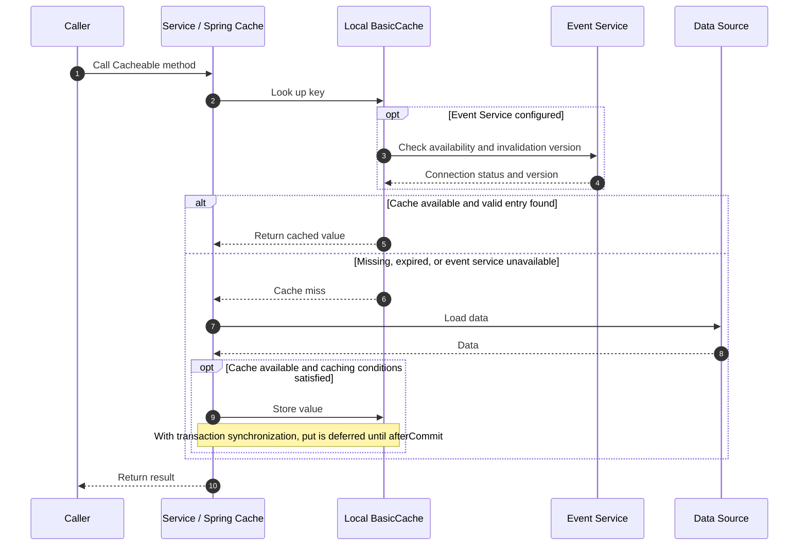

# Polar Bear Cache

English | [繁體中文](README.zh-TW.md)

Serve reads from local caches and broadcast invalidation events across service instances to reduce remote cache lookups, network I/O, and object reconstruction costs. Integrates with Spring Cache's `@Cacheable`, `@CachePut`, and `@CacheEvict`.

Best suited for data that is read frequently, changes less often, and can tolerate event delivery delays. Each instance maintains its own cache; events carry invalidation notifications, not cached values.

## Quick start

The source targets Java 11, with Spring Boot 2.7.18 and Spring Framework 5.3.39 as the compatibility baseline in the POM. This version includes publicly available dependency security updates, but known Spring 5 / Boot 2 vulnerabilities remain. Applications that manage dependencies through their own BOM must verify the resolved versions.

```xml
<dependency>
    <groupId>io.github.babyblue94520</groupId>
    <artifactId>polar-bear-cache</artifactId>
    <version>1.2.3-RELEASE</version>
</dependency>
```

Enable it in a Spring Boot application:

```java
import org.springframework.boot.SpringApplication;
import org.springframework.boot.autoconfigure.SpringBootApplication;
import pers.clare.polarbearcache.EnablePolarBearCache;

@EnablePolarBearCache
@SpringBootApplication
public class Application {
    public static void main(String[] args) {
        SpringApplication.run(Application.class, args);
    }
}
```

A `BasicCacheManager` and cache dependency management components are created automatically by default. No manual manager setup is required. Without a `PolarBearCacheEventService` bean, caching is local only.

## Reading and updating caches

Place the following methods in a Spring-managed service. `User` and `repository` represent your application's data type and data source. Calls must go through a Spring proxy; direct calls within the same object do not trigger interception.

```java
@Cacheable(cacheNames = "User", key = "#id", unless = "#result == null")
public User find(Long id) {
    return repository.findById(id).orElse(null);
}

@CachePut(cacheNames = "User", key = "#result.id")
public User save(User user) {
    return repository.save(user);
}

@CacheEvict(cacheNames = "User", key = "#id")
public void delete(Long id) {
    repository.deleteById(id);
}

@CacheEvict(cacheNames = "User", allEntries = true)
public void deleteAll() {
    repository.deleteAll();
}
```

| Operation | Local behavior | With an event service configured |
| --- | --- | --- |
| `@Cacheable` | Return the cached value on a hit; load on a miss | Do not broadcast read results |
| `@CachePut` | Spring caches the method's return value, and dependent caches are invalidated | Send an invalidation notification for the key |
| `@CacheEvict` | Invalidate the key and its dependents | Send an invalidation notification for the key |
| `@CacheEvict(allEntries = true)` | Clear the specified cache and its dependents | Send a notification to clear that cache |

Receivers perform local invalidation without broadcasting another notification. If a reload handler is registered, invalidation can reload data instead; see below.

Cache operations use Spring's annotation parsing, including interfaces, composed annotations, `@AliasFor`, `@Caching`, and `@CacheConfig` defaults. `@CachePut` notifications honor the operation's `cacheManager`, `cacheResolver`, `keyGenerator`, `condition`, and `unless` settings.

### Time to live and expiration extension

```yaml
polar-bear-cache:
  duration: 30s
  extension: false
```

- Without a configured duration, entries do not expire by time.
- With `extension: true`, each hit on a valid entry resets its time to live.
- Expiration is checked on reads. The manager also runs background expiration cleanup every 60 seconds.

Use `@CacheAlive` on a class or method to override cache settings. Method settings take precedence:

```java
@CacheAlive(value = "30s", extension = true)
@Cacheable(cacheNames = "User", key = "#id")
public User find(Long id) {
    return repository.findById(id).orElse(null);
}
```

The fully qualified name is `pers.clare.polarbearcache.annotation.CacheAlive`. Durations such as `PT30S` are also supported. Settings are shared by cache name, so use consistent TTL and extension settings for the same cache to avoid methods overwriting each other's configuration.

### Transaction behavior

When Spring transaction synchronization is active, mutations and notifications from `put`, `putIfAbsent`, `evict`, `clear`, and `putNotify` are deferred until `afterCommit`. Otherwise, they execute immediately. Within a transaction, `putIfAbsent` does not guarantee that the value has been stored when the method returns.

The `get(key, Callable)` method used by `@Cacheable(sync = true)` loads atomically and caches immediately. A rollback does not undo that cached value. Callers must avoid caching uncommitted data; this library does not provide transaction isolation.

## Events across service instances

Provide a `PolarBearCacheEventService` bean to enable events for the default manager. The application implements the connection, subscription, retry, and shutdown lifecycle for Redis Pub/Sub or another messaging system. This project does not include a Redis client.

The event service must implement:

```java
public interface PolarBearCacheEventService {
    void send(String body);
    void addListener(java.util.function.Consumer<String> listener);
    boolean isAvailable();
    long getInvalidationVersion();
}
```

### Implementation contract

1. `send` broadcasts the body unchanged to every instance in the same cache group, including the sender's own listener. The manager records local send markers to skip its own echoed events.
2. `addListener` registers a receive callback. Preserve the complete message body. Do not use competing consumers that deliver an event to only one instance in the group.
3. `isAvailable` returns true only when both sending and subscribing are operational. During an outage, BasicCache reads bypass the cache, and writes do not populate normal cache entries.
4. `getInvalidationVersion` must be thread-safe and increment whenever events may have been missed. Update the version before reporting the recovered connection as available.
5. The version must change even if no cache requests occur during the entire disconnect and reconnect interval. Changing availability alone cannot detect that case.

An adapter can use the following state management snippet, with state updated by the transport's connection and subscription callbacks:

```java
private final AtomicLong invalidationVersion = new AtomicLong();
private volatile boolean available;

// Called by the transport whenever events may have been missed.
public synchronized void onDisconnected() {
    available = false;
    invalidationVersion.incrementAndGet();
}

// Confirm that the subscription has recovered; a TCP connection alone is insufficient.
public synchronized void onSubscriptionReady() {
    available = true;
}

@Override
public boolean isAvailable() {
    return available;
}

@Override
public long getInvalidationVersion() {
    return invalidationVersion.get();
}
```

`AtomicLong` is from `java.util.concurrent.atomic`. This snippet only illustrates state management, not a complete transport adapter. Implementations must also handle retries and callbacks from obsolete connections.

On cache access after recovery, the manager checks the version and replaces BasicCache storage, discarding stale values even if they have not been read. This does not broadcast events, run reload handlers, or invoke normal `onClear` callbacks. Deferred writes and reload results that captured the old storage cannot write into the new storage.

Notifications provide asynchronous invalidation. Delivery delays, lost events, and send failures must be addressed by the transport's reliability design. This library does not guarantee strong consistency across services or include persistent event retries.

### Multiple managers

Inject a separate event service into each manager, using a distinct topic or channel. Corresponding managers across service instances should subscribe to the same topic.

When configuring a manager manually, use the current constructor and explicitly supply the event service:

```java
@Bean("userCacheManager")
public PolarBearCacheManager userCacheManager(
        CacheAnnotationFactory factory,
        PolarBearCacheProperties properties,
        PolarBearCacheDependencies dependencies,
        @Qualifier("userCacheEvents") PolarBearCacheEventService events) {
    return new BasicCacheManager(factory, properties, dependencies, events);
}
```

`CacheAnnotationFactory` is in `pers.clare.polarbearcache.proccessor`, and `BasicCacheManager` is in `pers.clare.polarbearcache.impl`.

Select the manager explicitly in annotations:

```java
@CachePut(cacheNames = "User", cacheManager = "userCacheManager", key = "#result.id")
public User save(User user) {
    return repository.save(user);
}
```

With multiple managers, explicitly configure Spring's default manager and prefer specifying `cacheManager` or `cacheResolver`. When neither is specified, the notification logic searches for the cache in injection order. BasicCacheManager creates caches dynamically, so cache names alone cannot determine which manager owns a cache.

## Cache dependencies

The following configuration runs during initialization. `dependencies` is an injected `PolarBearCacheDependencies`:

```java
// When User is invalidated, invalidate the same key in SimpleUser.
dependencies.depend("SimpleUser", "User");

// When any User key is invalidated, clear the entire AllUsers cache.
dependencies.depend("AllUsers", true, "User");

// Supply a mapping function when dependent keys differ.
dependencies.depend("UserSummary", key -> "summary:" + key, "User");
```

The first argument names the dependent cache; subsequent names identify its sources. Invalidation propagates through dependencies. Receiving a remote invalidation also processes local dependencies.

## Reload and clear callbacks

In this snippet, `cacheManager` is an injected `PolarBearCacheManager`:

```java
cacheManager.<User>onEvict("User", (key, oldValue) ->
        repository.findById(Long.valueOf(key)).orElse(null));

cacheManager.onClear("AllUsers", () -> refreshLocalIndex());
```

- A non-null result from an `onEvict` handler attempts to update the cache; a null result removes the original value.
- Single-key invalidation can invoke the handler even without an existing value, so `oldValue` may be null. Clearing a cache processes its existing entries individually.
- If a handler throws, the error is logged and removal of the original value is attempted. Remaining invalidations and notifications continue.
- If the same key is updated while the handler runs, conditional removal or replacement preserves the new value.
- Handlers should query the data source directly instead of reading the data being invalidated through the same cache.

### Programmatic invalidation

```java
cacheManager.evict("User", "42");     // Invalidate locally, process dependencies, and notify.
cacheManager.clear("User");           // Clear the cache and its dependents, and notify.
cacheManager.clear();                 // Clear all caches and notify.

cacheManager.onlyEvict("User", "42"); // Invalidate locally and process dependencies only.
cacheManager.onlyClear("User");       // Clear locally and process dependencies only.
cacheManager.onlyClear();             // Clear all local caches only.
```

The `only*` methods execute immediately without sending notifications. Named manager methods process dependencies; calling `onlyEvict` or `onlyClear` directly on a cache affects only that cache.

## Custom implementations and migration

- `PolarBearCache.putNotify(String key)` is required. Custom implementations must explicitly provide notification behavior.
- Custom `PolarBearCacheEventService` implementations must implement the invalidation version contract.
- The Composite manager, EventSender, and EventReceiver have been removed. Event handling is integrated into each manager.
- Logging uses the SLF4J API. The application supplies the logging backend.
- BasicCache converts keys to strings. Distinct keys must have distinguishable string representations.
- By default, there is no TTL or capacity limit. Use an appropriate invalidation strategy when caching many distinct keys.

## Architecture diagrams

### Local reads


```mermaid
sequenceDiagram
    autonumber
    participant Client as Caller
    participant Service as Service / Spring Cache
    participant Cache as Local BasicCache
    participant Events as Event Service
    participant DB as Data Source

    Client->>Service: Call Cacheable method
    Service->>Cache: Look up key
    opt Event Service configured
        Cache->>Events: Check availability and invalidation version
        Events-->>Cache: Connection status and version
    end
    alt Cache available and valid entry found
        Cache-->>Service: Return cached value
    else Missing, expired, or event service unavailable
        Cache-->>Service: Cache miss
        Service->>DB: Load data
        DB-->>Service: Data
        opt Cache available and caching conditions satisfied
            Service->>Cache: Store value
            Note over Service,Cache: With transaction synchronization, put is deferred until afterCommit
        end
    end
    Service-->>Client: Return result
```

This diagram shows a regular `@Cacheable` call. With `sync = true`, `get(key, Callable)` loads atomically and caches immediately; rollback does not undo the cached value.

### Mutations and invalidation notifications

```mermaid
sequenceDiagram
    autonumber
    participant Client as Caller
    participant A as Service A
    participant DB as Data Source
    participant CA as A's Cache / Manager
    participant MQ as Event Service / Topic
    participant CB as B's Cache / Manager

    Client->>A: Call CacheEvict method
    A->>DB: Update data
    DB-->>A: Update complete
    A->>CA: evict(key) or clear(name)
    Note over A,CA: With transaction synchronization, the following actions wait until afterCommit
    CA->>CA: Invalidate locally and process dependencies
    Note over CA: If a reload handler exists, attempt to update or remove the old value
    CA->>CA: Record local send marker
    CA->>MQ: Send invalidation event
    par Echo to Service A
        MQ-->>CA: Receive event
        CA->>CA: Consume matching marker and skip own echo
    and Broadcast to Service B
        MQ-->>CB: Receive event
        CB->>CB: onlyEvict / onlyClear and process dependencies
        Note over CB: Local processing only; no further notification
    end
    A-->>Client: Return result
```

This example uses the default invalidation after method execution. Event reception is asynchronous and may finish after the caller receives the result. The two receive branches do not imply a delivery order across instances. For `@CachePut`, Spring stores the return value locally, then the notification logic processes dependencies and sends an invalidation event.

### Disconnection and recovery

```mermaid
sequenceDiagram
    autonumber
    participant Transport as Message Connection / Subscription
    participant Events as Event Service
    participant Client as Caller
    participant Manager as BasicCacheManager
    participant Cache as Local BasicCache
    participant DB as Data Source

    Transport-->>Events: Disconnected or events may have been missed
    Events->>Events: available = false; increment invalidation version
    opt Reads during outage
        Client->>Cache: Read
        Cache->>Manager: isCacheable()
        Manager->>Events: Check availability
        Events-->>Manager: false
        Manager-->>Cache: Bypass cache
        Cache-->>Client: Cache miss
        Client->>DB: Load data
        DB-->>Client: Return result
    end
    Transport-->>Events: Subscription recovered
    Events->>Events: available = true
    Client->>Cache: Read after recovery
    Cache->>Manager: isCacheable()
    Manager->>Events: Check availability and invalidation version
    Events-->>Manager: true and new version
    Manager->>Cache: Replace managed BasicCache storage
    Note over Manager,Cache: Discard old values without reload, onClear, or broadcast
    Manager-->>Cache: New storage available
    Cache-->>Client: Cache miss; reload data
```

The invalidation version changes even when there are no requests during an outage, allowing accesses after recovery to detect and discard stale cache data.

## Development and verification

```shell
mvn test
mvn package
```

`mvn package` includes tests. Build with JDK 11 or later; the compilation target is Java 11.

License: GPL-3.0. See [LICENSE](LICENSE).
