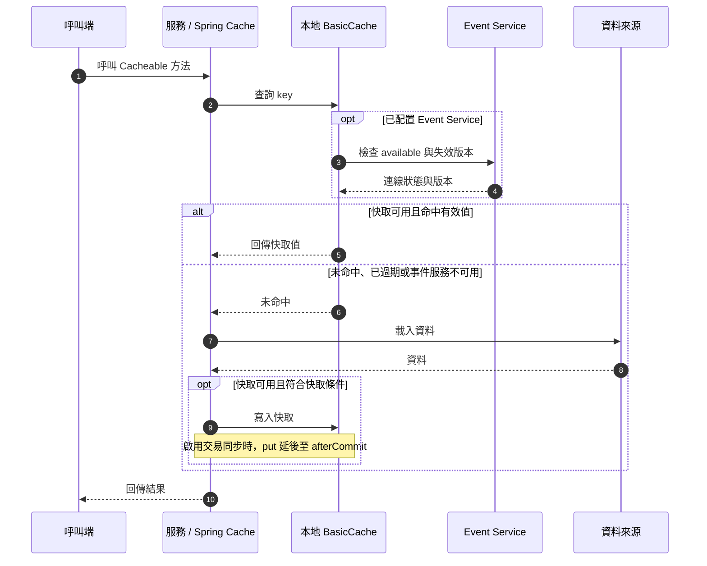
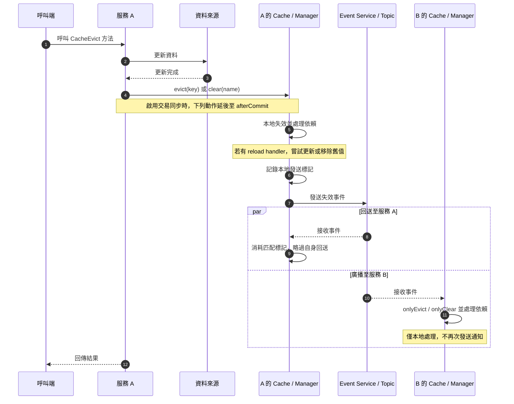
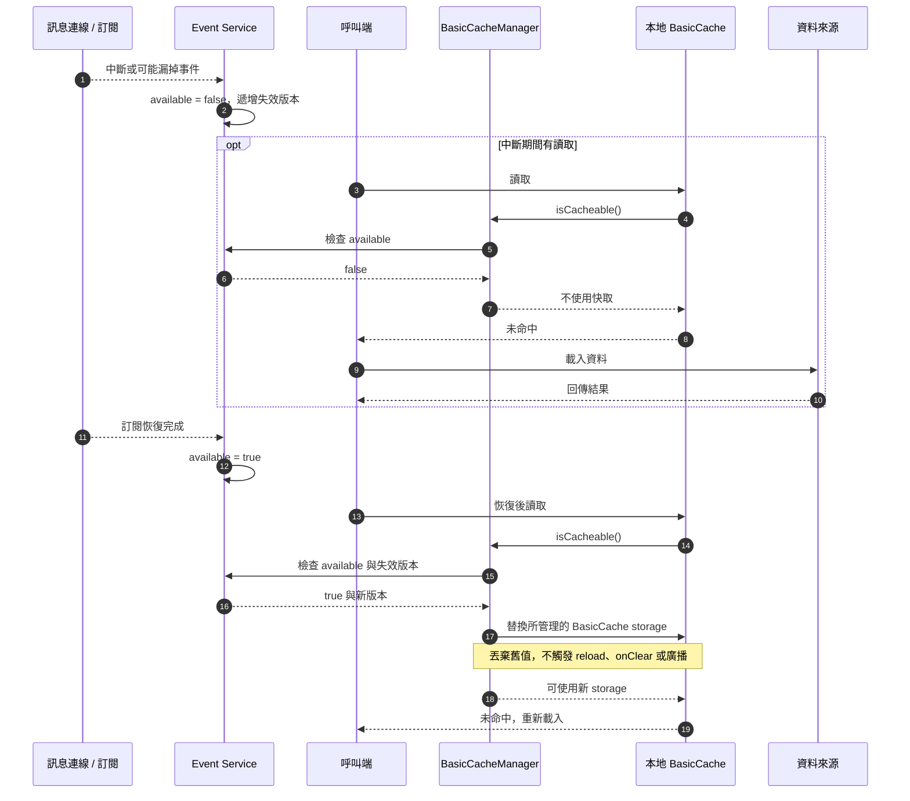

# Polar Bear Cache

[English](README.md) | 繁體中文

以本地快取處理讀取，透過事件廣播讓多個服務實例清除失效資料，減少遠端快取查詢、網路 I/O 與物件重建成本。整合 Spring Cache 的 `@Cacheable`、`@CachePut` 與 `@CacheEvict`。

適合讀取頻繁、異動較少，且可以接受事件傳遞延遲的資料。各實例保有自己的快取；事件傳遞的是失效通知，不是快取值。

## 快速開始

目前原始碼以 Java 11 編譯，POM 使用 Spring Boot 2.7.18 與 Spring Framework 5.3.39 作為相容基準。此版本包含可公開取得的依賴安全更新，但仍有 Spring 5／Boot 2 的已知漏洞。使用端若透過自己的 BOM 管理依賴，須另外確認最終解析版本。

```xml
<dependency>
    <groupId>io.github.babyblue94520</groupId>
    <artifactId>polar-bear-cache</artifactId>
    <version>1.2.3-RELEASE</version>
</dependency>
```

在 Spring Boot 應用程式啟用：

```java
import org.springframework.boot.SpringApplication;
import org.springframework.boot.autoconfigure.SpringBootApplication;
import pers.clare.polarbearcache.EnablePolarBearCache;

@EnablePolarBearCache
@SpringBootApplication
public class Application {
    public static void main(String[] args) {
        SpringApplication.run(Application.class, args);
    }
}
```

預設會自動建立 `BasicCacheManager` 與快取依賴管理元件，不需要手動建立 manager。未提供 `PolarBearCacheEventService` Bean 時，只使用本地快取。

## 快取讀取與更新

以下片段放在 Spring 管理的 service 中；`User` 與 `repository` 代表應用程式自己的資料型別及資料來源。透過 Spring proxy 呼叫註解方法，同一物件內的直接呼叫不會觸發攔截。

```java
@Cacheable(cacheNames = "User", key = "#id", unless = "#result == null")
public User find(Long id) {
    return repository.findById(id).orElse(null);
}

@CachePut(cacheNames = "User", key = "#result.id")
public User save(User user) {
    return repository.save(user);
}

@CacheEvict(cacheNames = "User", key = "#id")
public void delete(Long id) {
    repository.deleteById(id);
}

@CacheEvict(cacheNames = "User", allEntries = true)
public void deleteAll() {
    repository.deleteAll();
}
```

| 操作 | 本地行為 | 已配置 event service 時 |
| --- | --- | --- |
| `@Cacheable` | 命中時回傳快取，未命中時載入 | 不廣播讀取結果 |
| `@CachePut` | Spring 寫入方法回傳值，並清除相關依賴 | 發出對應 key 的失效通知 |
| `@CacheEvict` | 清除對應 key 與相關依賴 | 發出對應 key 的失效通知 |
| `@CacheEvict(allEntries = true)` | 清除指定快取及相關依賴 | 發出該快取的清除通知 |

接收端只執行本地失效處理，不再次發送通知。若註冊 reload handler，失效處理可改為重新載入資料，詳見下方說明。

Cache operation 使用 Spring 的 annotation 解析，包含 interface、組合註解、`@AliasFor`、`@Caching` 及 `@CacheConfig` 預設值。`@CachePut` 通知依 operation 的 `cacheManager`、`cacheResolver`、`keyGenerator`、`condition` 與 `unless` 處理。

### 存活時間與延長

```yaml
polar-bear-cache:
  duration: 30s
  extension: false
```

- 未設定 duration 時，預設不因時間到期。
- `extension: true` 表示有效快取每次命中後重新計算存活時間。
- 讀取時會檢查是否過期；manager 另有每 60 秒執行的背景過期清理。

使用 `@CacheAlive` 覆寫指定快取的設定，可標在類別或方法上，方法設定優先：

```java
@CacheAlive(value = "30s", extension = true)
@Cacheable(cacheNames = "User", key = "#id")
public User find(Long id) {
    return repository.findById(id).orElse(null);
}
```

`CacheAlive` 的完整類名是 `pers.clare.polarbearcache.annotation.CacheAlive`，時間也可使用 `PT30S`。設定以 cache name 共用，同名快取應使用一致的 TTL 與 extension，避免不同方法的設定互相覆蓋。

### 交易行為

當 Spring transaction synchronization 啟用時，`put`、`putIfAbsent`、`evict`、`clear` 及 `putNotify` 的變更／通知會延後至 afterCommit 執行；未啟用時立即執行。交易中的 `putIfAbsent` 不保證回傳時資料已寫入。

`@Cacheable(sync = true)` 使用的 `get(key, Callable)` 會原子載入並立即快取，rollback 不會撤銷該值。呼叫端必須自行避免快取未 commit 的資料；本元件不提供交易隔離。

## 多服務事件整合

提供 `PolarBearCacheEventService` Bean，即可讓預設 manager 使用事件服務。Redis Pub/Sub 或其他訊息系統的連線、訂閱、重試與關閉生命週期由應用程式實作，本專案不內建 Redis client。

事件服務必須實作：

```java
public interface PolarBearCacheEventService {
    void send(String body);
    void addListener(java.util.function.Consumer<String> listener);
    boolean isAvailable();
    long getInvalidationVersion();
}
```

### 實作契約

1. `send` 將 body 原樣廣播給相同快取群組的所有實例，包含發送端自己的 listener。manager 會記錄本地發送標記，以略過自己的回送事件。
2. `addListener` 註冊接收回呼，訊息 body 必須保持完整。不要把同一群組配置成只有其中一個實例能收到的競爭消費模式。
3. `isAvailable` 只有在事件發送與訂閱都可正常使用時才回傳 true。中斷期間，BasicCache 的讀取繞過快取，寫入也不會建立一般快取資料。
4. `getInvalidationVersion` 必須 thread-safe，並在可能漏掉事件時遞增。必須先更新版本，再讓恢復的連線對外回報 available。
5. 即使整段斷線、重連期間完全沒有快取請求，版本也必須改變；只修改 available 不足以偵測這種情況。

可在 adapter 中使用下列狀態管理片段，並由實際 transport 的連線／訂閱回呼更新狀態：

```java
private final AtomicLong invalidationVersion = new AtomicLong();
private volatile boolean available;

// 由 transport 在可能漏事件時呼叫。
public synchronized void onDisconnected() {
    available = false;
    invalidationVersion.incrementAndGet();
}

// 必須確認訂閱已恢復；只有 TCP 連上還不夠。
public synchronized void onSubscriptionReady() {
    available = true;
}

@Override
public boolean isAvailable() {
    return available;
}

@Override
public long getInvalidationVersion() {
    return invalidationVersion.get();
}
```

`AtomicLong` 來自 `java.util.concurrent.atomic`。此片段只展示狀態管理，不是完整 transport adapter；實作仍需處理失敗重試與過期連線回呼。

manager 在恢復後的快取存取中檢查版本，替換 BasicCache 的 storage，丟棄未被讀取的舊值。此動作不廣播、不執行 reload handler，也不觸發一般 `onClear` 回呼。先前捕捉舊 storage 的延後寫入與 reload 結果不會寫入新的 storage。

通知是非同步失效機制，傳遞延遲、遺失及發送失敗仍需由 transport 的可靠性設計處理；本元件不保證跨服務的強一致性，也不內建持久化事件重試。

### 多個 manager

每個 manager 應注入自己的 event service，使用獨立 topic／channel；不同服務實例中對應的 manager 則訂閱同一個 topic。

手動配置 manager 時，使用目前的建構子並明確指定 event service：

```java
@Bean("userCacheManager")
public PolarBearCacheManager userCacheManager(
        CacheAnnotationFactory factory,
        PolarBearCacheProperties properties,
        PolarBearCacheDependencies dependencies,
        @Qualifier("userCacheEvents") PolarBearCacheEventService events) {
    return new BasicCacheManager(factory, properties, dependencies, events);
}
```

`CacheAnnotationFactory` 位於 `pers.clare.polarbearcache.proccessor`，`BasicCacheManager` 位於 `pers.clare.polarbearcache.impl`。

使用註解明確指定：

```java
@CachePut(cacheNames = "User", cacheManager = "userCacheManager", key = "#result.id")
public User save(User user) {
    return repository.save(user);
}
```

多 manager 時應明確配置 Spring 預設 manager，並優先指定 `cacheManager` 或 `cacheResolver`。目前通知邏輯在兩者皆未指定時依注入順序尋找 cache；BasicCacheManager 會動態建立 cache，因此不能靠 cache name 自動判定歸屬。

## 快取依賴

以下為初始化階段的設定片段，`dependencies` 是注入的 `PolarBearCacheDependencies`：

```java
// User 失效時，清除相同 key 的 SimpleUser。
dependencies.depend("SimpleUser", "User");

// User 任一 key 失效時，清除整份 AllUsers。
dependencies.depend("AllUsers", true, "User");

// 依賴的 key 不同時，可提供轉換函式。
dependencies.depend("UserSummary", key -> "summary:" + key, "User");
```

第一個參數是「依賴其他快取的名稱」，後面的名稱是來源。依賴清除會沿關係傳遞；接收遠端失效通知時也會處理本地依賴。

## Reload 與清除回呼

以下片段中的 `cacheManager` 是注入的 `PolarBearCacheManager`：

```java
cacheManager.<User>onEvict("User", (key, oldValue) ->
        repository.findById(Long.valueOf(key)).orElse(null));

cacheManager.onClear("AllUsers", () -> refreshLocalIndex());
```

- `onEvict` handler 回傳非 null 時嘗試更新快取；回傳 null 時移除原值。
- 單 key 失效即使沒有舊值也可呼叫 handler，`oldValue` 可能是 null。整份 clear 則逐一處理既有 entry。
- handler 發生例外時記錄錯誤並嘗試移除原值，繼續其餘清除與通知流程。
- handler 執行期間若同 key 已被更新，條件式移除／替換會保留新值。
- handler 應直接查詢資料來源，避免再透過相同快取取得待失效資料。

### 程式化清除

```java
cacheManager.evict("User", "42");     // 本地失效、依賴清除並發送通知
cacheManager.clear("User");           // 清除指定快取、依賴並發送通知
cacheManager.clear();                 // 清除所有快取並發送通知

cacheManager.onlyEvict("User", "42"); // 僅本地失效及依賴處理
cacheManager.onlyClear("User");       // 僅本地清除及依賴處理
cacheManager.onlyClear();             // 僅本地清除所有快取
```

`only*` 方法不發送通知，且立即執行。manager 的具名方法會處理依賴；直接呼叫 cache 的 `onlyEvict`／`onlyClear` 只作用於該 cache。

## 自訂實作與升級注意事項

- `PolarBearCache.putNotify(String key)` 是必要方法，自訂實作必須明確提供通知行為。
- 自訂 `PolarBearCacheEventService` 必須實作失效版本契約。
- 已移除 Composite manager、EventSender 與 EventReceiver；事件收發整合在各 manager 內。
- 日誌使用 SLF4J API，實際 logging backend 由應用程式提供。
- BasicCache 將 key 轉成字串；不同 key 的字串表示必須能區分。
- 預設無 TTL 且沒有容量上限；大量不同 key 應搭配適當失效策略。

## 架構圖

### 本地讀取



此圖呈現一般 `@Cacheable`；`sync = true` 透過 `get(key, Callable)` 原子載入並立即快取，rollback 不撤銷快取。

### 異動與失效通知



此圖以預設方法執行後的失效為例。事件接收是非同步的，可能在呼叫端收到結果之後才完成；圖中兩個接收分支不代表跨實例的送達順序。`@CachePut` 則由 Spring 寫入本地回傳值，再由通知邏輯處理依賴並發送失效事件。

### 斷線與恢復



即使斷線期間沒有請求，失效版本仍會改變，讓恢復後的存取能辨識並丟棄舊快取。

## 開發與驗證

```shell
mvn test
mvn package
```

`mvn package` 包含測試。使用 JDK 11 或更新版本執行建置，編譯目標為 Java 11。

授權：GPL-3.0，詳見 [LICENSE](LICENSE)。
